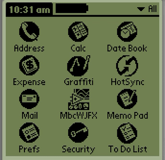

# MbcWJFX



這是我在好幾年前，在使用過 LabVIEW 之後深深為之著迷，
於是我在 Palm 上面開發的一套類 LabVIEW 的流程圖式程式語言（visual dataflow programming language）。
實作了四則運算、迴圈處理等基本程式邏輯。

程式碼寫於 2003 年，開發環境是 CodeWarrior for Palm OS。

> **不想裝模擬器？直接開 [線上版](https://pondahai.github.io/MbcWJFX/)。**
> 這是把當年那支程式重新寫成的網頁版，同一套執行模型、同一份存檔格式。
> 詳見下面的[網頁版](#網頁版)。


---

## 這是什麼

在 160×160 的 Palm 螢幕上，用觸控筆把「方塊」拖到畫面上、再用線把方塊的輸出接點連到另一個方塊的輸入接點，就構成一支程式。按下執行鍵後，資料會沿著線流動（畫面上看得到跑動的資料點），每個方塊在自己的輸入都備妥時被觸發計算——這就是 dataflow（資料流）的執行模型，跟 LabVIEW 一樣，而不是傳統由上往下逐行執行的程式。

### 已實作的功能

| 類別 | 內容 |
|------|------|
| 算術 | 加、減、乘、除 |
| 邏輯 | AND、OR、NOT |
| 比較 | `>`、`<`、`=`、`<=`、`>=` |
| 結構 | For 迴圈、While 迴圈、Switch/Case |
| 前面板 | 數值控制項 / 顯示器、開關 / LED（可與流程圖分離操作，同 LabVIEW 的 Front Panel 概念） |
| 自訂方塊 | 把一張流程圖包成一個可重複使用的方塊（Custom Block），可巢狀 |
| 存檔 | 存入 Palm 資料庫（PDB），可重新載入 |
| 執行 | 單步 / 連續執行、動畫顯示資料流動、停止 |

---

## 怎麼跑

### 直接執行（不需編譯）

`Starter.prc` 就是已經編譯好的 Palm 應用程式（約 64 KB），可以直接安裝執行。

**選項 A — 用模擬器（推薦）**

- **[Mu](https://github.com/meepingsnesroms/Mu)**：跨平台的 Palm 模擬器，也有 [線上版](https://palmdb.net/app/mu-emulator)，把 `Starter.prc` 拖進去即可。
- **POSE（Palm OS Emulator）**：需要另外準備一份 Palm OS 3.x/4.x 的 ROM 映像檔，載入後用 *Install Application* 安裝 `Starter.prc`。

**選項 B — 真機**

透過 HotSync 或任何 PRC 安裝工具把 `Starter.prc` 灌進 Palm OS 2.0 以上的機器。

> 最低系統需求定義在 `Src/vpl.h`：`sysMakeROMVersion(2,0,0,...)`，也就是 Palm OS 2.0。

### 從原始碼編譯

專案檔是 **CodeWarrior for Palm OS**（`VPL.mcp`），資源檔 `Src/starter.rsrc` 是用 **Constructor for Palm OS 1.5** 編輯的，`Src/StarterRsc.h` / `Src/StarterRsc.c` 由 Constructor 自動產生，請勿手動修改。

如果手邊沒有 CodeWarrior（現在已經很難取得），理論上可以改用 **PRC-Tools**（gcc 的 m68k-palmos 版本）或 **PalmDev / pilrc** 這條開源工具鏈重建，但需要把 `.rsrc` 轉成 `.rcp`，本 repo 尚未做這件事。

---

## 網頁版

**線上版：<https://pondahai.github.io/MbcWJFX/>**（手機也能開）

`web/vpl.html` 是把這支程式重新寫成的瀏覽器版本 —— **單一 HTML 檔、沒有
build step、打開就能跑**。不是模擬器，是照著 `Src/` 底下的 C 原始碼一個函式
一個函式重寫的：`Src/` 在這裡的角色是唯讀的規格書，JS 那邊每個函式上面都
標了對應的 C 檔名和行號（例如 `// run.c:1043 DoRun_LOOPBLOCK`），欄位名也
沿用 C 的寫法（`bap`、`BITMAPID`、`IONodeLLHead`）。

畫面一樣是 160×160，工具列、彈出面板、下拉選單都畫在那塊畫布裡面，位置照
`Src/StarterRsc.h` 的資源座標。圖是從編譯好的 `Starter.prc` 抽出來的 74 張
Tbmp（`web/tools/extract_bitmaps.py`），所以連圖示都是當年那幾張。

### 做到哪裡

| | |
|---|---|
| 編輯 | 從元件面板拿元件、拖曳（含拖進／拖出迴圈和 switch case）、接線（含跨結構邊界的 `CrossWire`）、剪線、刪除、改結構元件大小 |
| 執行 | 執行／單步／停止，`LAMP` 的線段動畫，`RUNFOREVER`，即時的節點狀態表 |
| 前面板 | Block / Panel 兩個分頁，手（搬位置）／手指（操作控制項）／鉛筆（數字鍵盤）三個工具 |
| 結構 | For / While 迴圈、Switch/Case、自訂元件（`HOOKBLOCK`），都可巢狀 |
| 檔案 | 原版的 SAVE / LOAD 表單，載入 `.pdb`（拖放或選檔），存成 `.pdb` 下載 |
| 選單 | File / Works / Run / About，內容取自 `Starter.prc` 的 MBAR 資源 |

存檔格式照的是原版 —— `.pdb` 裡是純 ASCII，`Src/save.c` 的
`DataStruct2ASCII()` 印出來那套。不過還**沒有拿真正由 Palm 寫出來的檔案
驗證過**（repo 裡沒留下任何當年存的 `.pdb`），目前的樣本是
`web/tools/make_sample_pdb.py` 照 `save.c` 的格式生的。如果你手上找得到
當年的檔案，值得拿來試。

### 跟原版不一樣的地方

都是刻意的，理由記在 [`web/PLAN.md`](web/PLAN.md)：

- 畫面倍率會自動配合視窗寬度（原版固定 1×，因為 Palm 螢幕就是 160×160）
- 右邊多一欄執行控制、場景結構樹、節點狀態表 —— 純粹是除錯用的介面
- Palm 是按硬體的 Menu 鍵叫選單，網頁沒有那顆鍵，改成一顆按鈕
- 存檔區用 `localStorage` 代替 Palm 的 database（原版一個存檔就是一個 database）
- 方塊圖工具列少一顆 PENCIL —— 原版排了它，但處理那兩段整個被註解掉，按了沒反應

### 在本機跑

```
python -m http.server 8778
```

然後開 `http://localhost:8778/web/vpl.html`。用 `file://` 開的話瀏覽器不准
fetch 本機檔案，量版面寬度也會失準。

### 想讀 / 想接手

| 檔案 | 內容 |
|---|---|
| [`web/PLAN.md`](web/PLAN.md) | **進度的唯一來源**。112 個函式逐一標了狀態，含刻意的介面差異，以及原版自己就沒做完的那幾處 |
| [`web/README.md`](web/README.md) | 跟 C 原始碼的對照表、存檔格式、執行模型、跨邊界資料流 |

---

## 程式架構

整份程式約 13,000 行 C，核心觀念只有三個。搞懂這三個，`Src/` 底下的檔案就都讀得動了。

### 1. 一切都是鏈結串列（`Src/vpl.h`）

```
HOOK ──── 一個「作用域」，內含一張完整的流程圖
 ├─ BlockLLHeadP ──► BN ──► BN ──► BN ...     方塊串列
 └─ WireLLHeadP  ──► WN ──► WN ──► WN ...     線段串列

BN (BlockNode)  一個方塊
 ├─ bap  ──► BA  ──► IONodeLLHead ──► IONODE ──► IONODE ...   流程圖上的外觀與 I/O 接點
 ├─ pap  ──► PA  ──► CTRLNodeLLHead ──► CTRLNODE ...          前面板上的外觀與控制點
 ├─ hookP / LoopBlockHOOKP / CaseBlockHOOKLLHeadP  ──► HOOK   內含的子圖（巢狀的關鍵）
 └─ PREVNODE / NEXTNODE

WN (wList)  一條線
 ├─ StartBlockP + StartNodeP     從哪個方塊的哪個接點出發
 └─ EndBlockP   + EndNodeP       接到哪個方塊的哪個接點
```

`IONODE.P` 是一個 `void*`，指向該接點實際持有的資料（大小由 `BYTES`/`NUMS` 描述），`TYPE` 標示這是輸入（1）、輸出（0）還是拖曳點（2）。

### 2. HOOK 造就巢狀

`HOOK` 是「一張流程圖」的封裝：一組方塊串列 + 一組線段串列。迴圈方塊的 `LoopBlockHOOKP`、Switch/Case 的每個 case、自訂方塊的 `hookP`，指的都是一個 HOOK。因為 HOOK 裡的方塊自己又可以有 HOOK，巢狀就自然成立，而執行引擎只要對 HOOK 遞迴呼叫自己即可。

全域的 `SYSHOOK` 是最外層那張主流程圖。

### 3. 執行 = NotReady + DIRTY 兩個旗標（`Src/run.c`）

這是整份程式最漂亮的部分：**執行動畫與求值是同一套機制**，動畫不是額外加上去的視覺效果。

- `IONODE.NotReady` — 這個接點的資料還沒備妥。`CheckConnection()` 在執行前依方塊類型把所有接點重設一次。
- `wList.DIRTY` — 這條線這一輪已經搬過資料了。
- `wList.RUNPOINT` / `RUNSEG` — 資料點目前跑到線上的哪個位置（動畫用）。

主迴圈 `DoRun(BlockLLHeadP, WireLLHeadP)`：

```
DoRun_WireRun()    沿著線把上游輸出搬到下游輸入，清掉下游的 NotReady
DoRun_BlockRun()   走訪方塊，輸入全部 ready 的就呼叫 DoItemRUN() 算它
                   遇到 HOOKBLOCK / LOOPBLOCK / CASEBLOCK 則遞迴進它的 HOOK
回傳 handle        還有東西可以算 → true，外層再叫一次；全部停滯 → false，程式結束
```

`DoItemRUN()` 是唯一真正做運算的地方，一個 `switch` 對應到每種方塊的 bitmap ID（`ADDBitmap`、`FORLOOPBitmap`…）。

若 `LAMP` 開啟（燈泡鈕，等同 LabVIEW 的 Highlight Execution），每一輪會先把資料點沿線推進一格再回傳，於是使用者看得到資料流動的過程。

### 檔案導覽

| 檔案 | 內容 |
|------|------|
| `Src/vpl.h` | 所有資料結構定義，**從這裡開始讀** |
| `Src/run.c` | 執行引擎（`DoRun` 及其遞迴分支） |
| `Src/block.c` | 流程圖畫面：繪製、拖曳、連線、事件處理（最大的檔案） |
| `Src/panel.c` | 前面板畫面 |
| `Src/linklist.c` | 所有串列的配置、插入、移除、釋放 |
| `Src/save.c` / `Src/load.c` | 序列化 / 反序列化到 Palm 資料庫 |
| `Src/db.c` | Palm DB 存取封裝 |
| `Src/functions.c` | 方塊工具箱（Functions 面板） |
| `Src/misc.c` | 繪圖與幾何的雜項工具 |
| `Src/mbcwjfx.c` | 程式進入點、主事件迴圈 |
| `Src/StarterRsc.h` / `.c` | Constructor 自動產生的資源 ID，勿手改 |

---

## 已知問題

保留原貌，未修改，列在這裡供閱讀時參考：

- `DoItemRUN()` 以 `IONodeLLHead->NEXT->NEXT` 硬編碼接點順序，載入不符預期的檔案時會 null dereference。
- 除法方塊沒有除以零的檢查。
- 部分檔案有 K&R 風格的隱式 int 宣告（`extern UID;`）。
- `Src/*.BAK` 與 `.svn/` 目錄是當年的遺留物。

## 編碼

原始碼的中文註解原本是 **Big5**，已全數轉換為 **UTF-8**。

## 授權

尚未指定。
